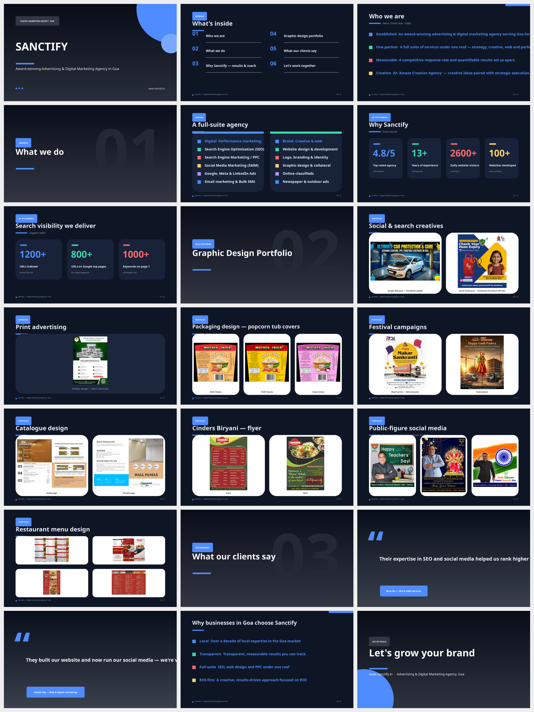
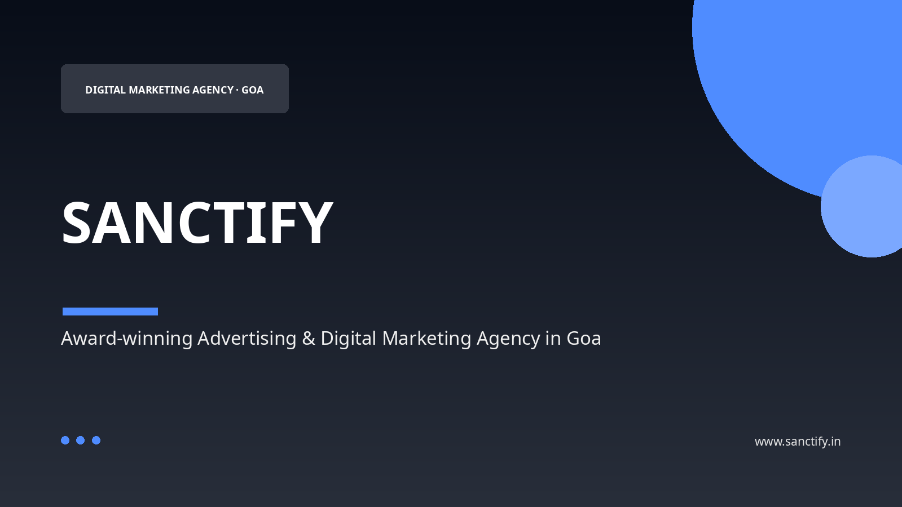
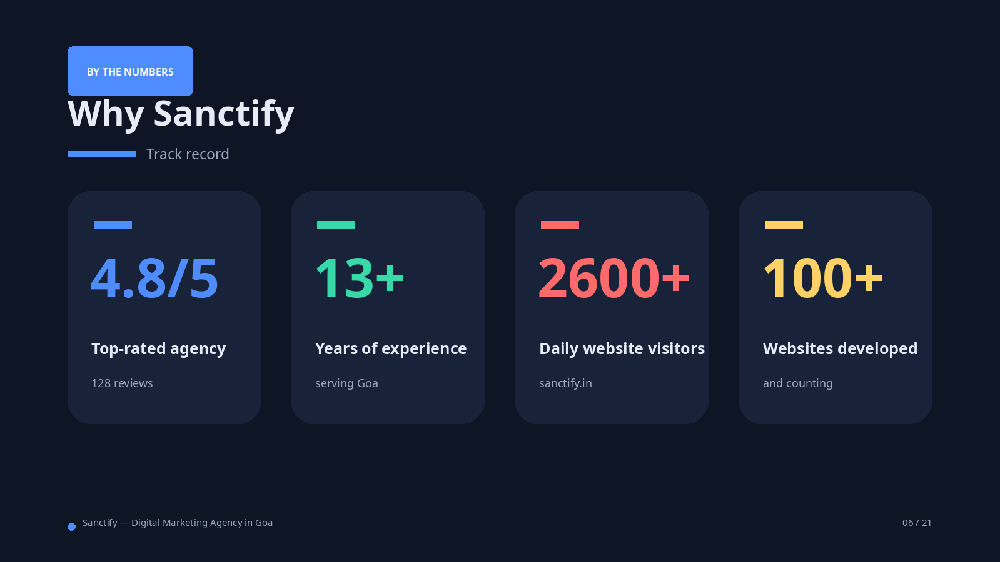
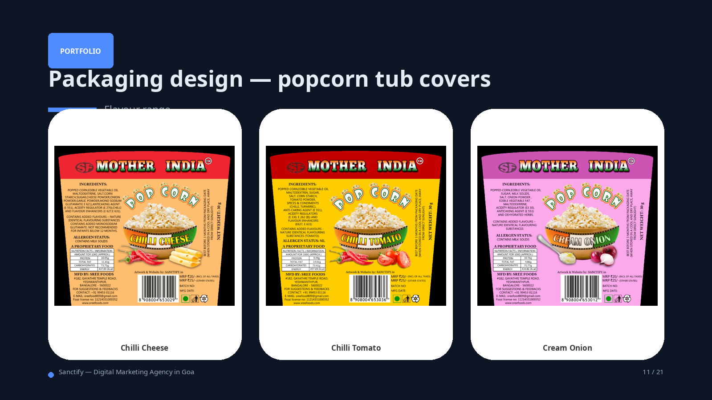
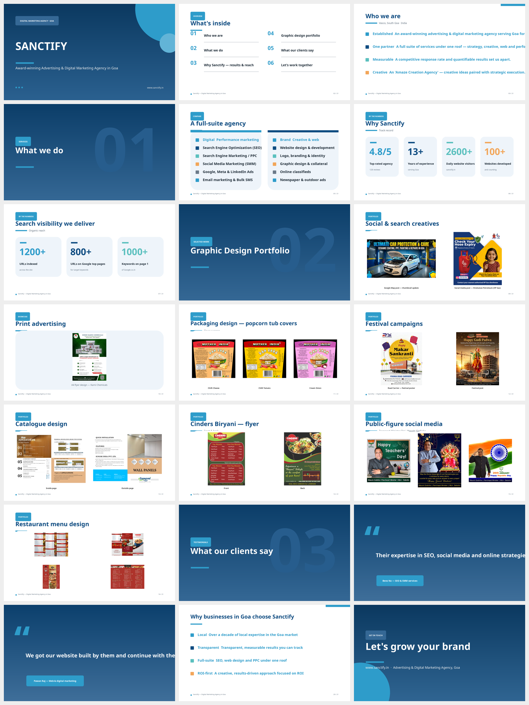

# Sanctify — Credentials & Portfolio Deck

A modern, 21-slide deck for **Sanctify**, an award-winning advertising & digital
marketing agency in Vasco, South Goa, India ([sanctify.in](https://www.sanctify.in)),
built with KimiAgent's modern rendering engine — gradient covers, ghosted section
numerals, pill "kicker" labels, rounded KPI cards, and a portfolio gallery on
soft mat cards.

## Preview

Dark (premium) variant — overview:



Cover · KPI stats · portfolio gallery:





Light (boardroom) variant — overview:



> Preview images are approximate raster renders produced by
> [`tools/preview_pptx.py`](../../tools/preview_pptx.py). Open the actual `.pptx`
> in PowerPoint / Keynote / Google Slides for the true result (gradients,
> shadows, rounded corners and text wrapping render exactly there).

## Files

| File | Description |
|------|-------------|
| `Sanctify-Digital-Marketing-Goa.pptx` | **Dark** theme (`midnight`) — premium, creative work pops |
| `Sanctify-Digital-Marketing-Goa-Light.pptx` | **Light** theme (`corporate`) — boardroom-friendly |
| `build_sanctify_deck.py` | The deck builder script |
| `assets/` | The 19 graphic-design portfolio images |

## Deck flow

1. Cover
2. Agenda
3. Who we are
4. What we do (section) + full-suite services
5. Why Sanctify — track record + search visibility (stats)
6. **Graphic design portfolio** (section) — 8 gallery slides showcasing all 19
   pieces: social & search creatives, print flyer, popcorn packaging (3 flavours),
   festival campaigns, catalogue, Cinders Biryani flyer, public-figure social
   media, and restaurant menu design
7. Testimonials
8. Why choose Sanctify
9. Contact / closing

## Rebuild

```bash
# From the repository root — builds both variants
python examples/sanctify/build_sanctify_deck.py

# Or a single theme (kimi, morandi, inkwash, corporate, forest, midnight)
python examples/sanctify/build_sanctify_deck.py forest
```

## Content sources

- Agency description, services, stats and testimonials: [sanctify.in](https://www.sanctify.in)
- Portfolio images: the agency's *Graphic Designs* document.
